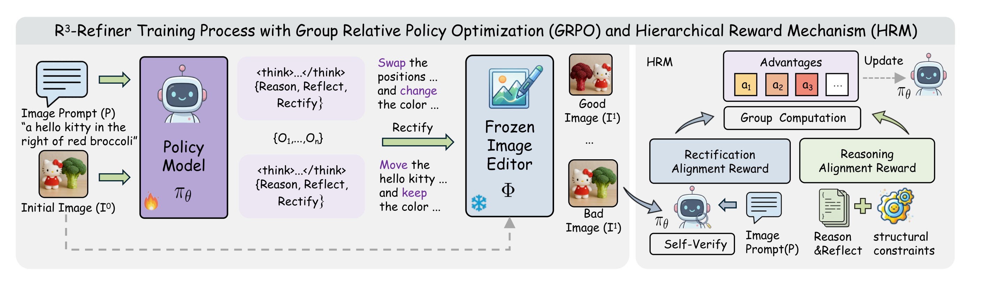

# R³-Refiner

R³-Refiner is the reinforcement-learning training stack for the R³ loop. It trains a reflective vision-language policy with GRPO and a Hierarchical Reward Mechanism (HRM).

<p align="left">
  
</p>

## Installation

```bash
pip install torch torchvision
pip install flash-attn --no-build-isolation
pip install -r requirements.txt
pip install -e .
```

Install the edit and reward backends you plan to use:

- BAGEL edit service: [BAGEL](https://github.com/bytedance-seed/BAGEL) runtime and weights.
- Qwen-Image-Edit service: `diffusers` with [Qwen-Image-Edit](https://huggingface.co/Qwen/Qwen-Image-Edit-2511) support and [cache-dit](https://github.com/vipshop/cache-dit).
- Self-reward service: a Qwen2.5-VL or Qwen3-VL checkpoint, such as [Qwen2.5-VL-7B-Instruct](https://huggingface.co/Qwen/Qwen2.5-VL-7B-Instruct) or [Qwen3-VL-8B-Instruct](https://huggingface.co/Qwen/Qwen3-VL-8B-Instruct), served through the self-reward API.
- SAM3 reward service: [SAM3](https://github.com/facebookresearch/sam3) package and checkpoints.

## Data

Training data uses JSON or JSONL records with image paths. The expected schema is described in [examples/data/README.md](examples/data/README.md).

We provide a small training demo:

- JSON: `examples/data/demo_train.json`
- Images: [nickname-xingxing/R3-Refiner_demoTrain](https://huggingface.co/datasets/nickname-xingxing/R3-Refiner_demoTrain)

Download and unpack the image archive:

```bash
export HF_DATASET_REPO=nickname-xingxing/R3-Refiner_demoTrain
huggingface-cli download "$HF_DATASET_REPO" demo_train_images.zip \
  --repo-type dataset --local-dir examples/data
unzip -o examples/data/demo_train_images.zip -d examples/data/images
```

The resulting image directory should be:

```text
examples/data/images/demo_train/
```

For the demo set:

```bash
export TRAIN_DATA_PATH=examples/data/demo_train.json
export VAL_DATA_PATH=examples/data/demo_train.json
export IMAGE_DIR=examples/data/images
export ROLLOUT_BATCH_SIZE=64
```

`train_quick.sh` uses `ROLLOUT_BATCH_SIZE=64` when `TRAIN_DATA_PATH` is the bundled demo JSON and `ROLLOUT_BATCH_SIZE` is unset.

To inspect the demo cases locally:

```bash
python3 tools/view_demo_data.py \
  --data examples/data/demo_train.json \
  --image-dir examples/data/images
```

## Services

R³-Refiner uses long-running HTTP services for image editing and reward scoring. A typical run uses an edit node, a reward node, and a training node. They can share one machine for local tests.

Start an edit service:

```bash
export EDIT_MODEL_PATH=/path/to/BAGEL-7B-MoT
export EDIT_MODEL_TYPE=bagel  # bagel or qwen_image_edit
bash distributed_services/scripts/deploy_services.sh edit_server \
  "$EDIT_MODEL_PATH" "$EDIT_MODEL_TYPE"
```

Start the self-reward service:

```bash
export REWARD_TYPE=self_reward
export SELF_REWARD_MODEL_PATH=/path/to/self_reward_checkpoint
export SELF_REWARD_MODEL_TYPE=qwen2_5vl  # qwen2_5vl or qwen3vl
bash distributed_services/scripts/deploy_services.sh reward_server
```

`REWARD_TYPE` selects the reward family. `SELF_REWARD_MODEL_TYPE` selects the model server implementation.

After services are running, generate and source endpoint variables on the training node:

```bash
bash distributed_services/scripts/deploy_services.sh get_config
source distributed_services/config/service_endpoints.env
```

If service nodes and the training node do not share a filesystem, copy the endpoint text files into `distributed_services/config/` on the training node before running `get_config`, or export the endpoint variables manually.

Detailed service deployment notes are in [docs/SERVICES.md](docs/SERVICES.md).

## Training

For Qwen2.5-VL experiments, initialize from [Qwen2.5-VL-7B-Instruct](https://huggingface.co/Qwen/Qwen2.5-VL-7B-Instruct).

Run the default VLM training entry:

```bash
export MODEL_PATH=/path/to/policy_or_base_vlm
export TRAIN_DATA_PATH=/path/to/train.json
export VAL_DATA_PATH=/path/to/val.json
export IMAGE_DIR=/path/to/images

bash distributed_services/scripts/train_quick.sh \
  worker.actor.global_batch_size=64
```

Common overrides:

```bash
export PROJECT_NAME=R3-Refiner
export EXPERIMENT_NAME=r3-refiner-grpo
export N_GPUS_PER_NODE=8
export FORMAT_PROMPT=examples/format_prompt/refiner_edit.jinja
export REWARD_FUNCTION=examples/reward_function/self_reward_staged_reward_api.py:compute_score
```

For larger training runs, set `worker.actor.global_batch_size` to a divisor of `ROLLOUT_BATCH_SIZE`. The default config uses 128.

To run stage-1 reward only:

```bash
export ENABLE_STAGE2=false
bash distributed_services/scripts/train_quick.sh
```

To run the full two-stage objective:

```bash
export ENABLE_STAGE2=true
bash distributed_services/scripts/train_quick.sh
```

If `ENABLE_STAGE2` is unset, stage-2 is enabled by default.

For a LLaVA-OneVision policy:

```bash
bash distributed_services/scripts/train_llava_onevision.sh
```

## Tools

- `tools/view_demo_data.py`: local Gradio viewer for the demo training cases.
- `tools/diagnose_training_runtime.py`: checks service endpoints, data paths, model metadata, and Ray startup on the current machine.
- `tools/model_merger.py`: merges FSDP-sharded actor checkpoints into Hugging Face format.

Merge a training checkpoint before evaluating with R3-Bench:

```bash
python3 tools/model_merger.py \
  --local_dir checkpoints/<project>/<experiment>/global_step_x/actor
```
