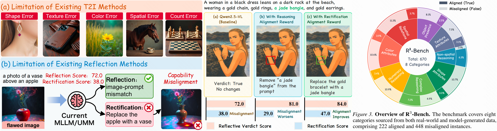

<h2 align="center">R³-Bench: Benchmarking and Evolving Reason-Reflect-Rectify<br>for Reflective Visual Generation</h2>

<p align="center">
  Junjie Wang<sup>1*</sup>,
  Xinghua Lou<sup>2,3*</sup>,
  Jason Li<sup>4</sup>,
  Ye Tian<sup>5</sup>,
  Keyu Chen<sup>1</sup>,
  Yulin Li<sup>1</sup>,
  Bin Kang<sup>6</sup>,
  Jacky Mai<sup>7</sup>,
  Yanwei Li<sup>8</sup>,
  Zhuotao Tian<sup>1,3†</sup>,
  Liqiang Nie<sup>1,3</sup>
</p>

<p align="center">
  <sup>1</sup>Harbin Institute of Technology, Shenzhen &nbsp;&nbsp;
  <sup>2</sup>University of Science and Technology of China
  <br>
  <sup>3</sup>Shenzhen Loop Area Institute &nbsp;&nbsp;
  <sup>4</sup>Nanyang Technological University &nbsp;&nbsp;
  <sup>5</sup>Peking University
  <br>
  <sup>6</sup>University of Chinese Academy of Sciences &nbsp;&nbsp;
  <sup>7</sup>Hong Kong Baptist University &nbsp;&nbsp;
  <sup>8</sup>Shanghai Jiao Tong University
</p>

<p align="center"><sup>*</sup>Equal Contribution &nbsp;&nbsp; <sup>†</sup>Corresponding Author</p>

<p align="center">
  <a href="https://arxiv.org/abs/2605.19639"></a>
  <a href="https://github.com/xiaomoguhz/R3-Bench"></a>
  <a href="https://huggingface.co/datasets/nickname-xingxing/R3-Bench"></a>
  <a href="https://huggingface.co/nickname-xingxing/R3-Refiner-Qwen2.5-VL-7B"></a>
</p>

## Overview

**R³-Bench** is a 670-sample benchmark that evaluates image-generation agents and Unified Multimodal Models (UMMs) on the closed-loop Reason-Reflect-Rectify task, providing a four-stage evaluation pipeline that reports the Reflective Verdict Score $`\mathcal{S}_{\text{ref}}`$ and the Rectification Score $`\mathcal{S}_{\text{rect}}`$. **R³-Refiner** is a reinforcement learning framework that optimizes the R³ loop via Group Relative Policy Optimization (GRPO) and a Hierarchical Reward Mechanism (HRM). The animation below shows R³-Refiner closing the Reason-Reflect-Rectify loop on two GenEval++ cases. In each round, the model verifies the rendered image, reflects on the observed mismatch, and issues a rectification edit, converging to a prompt-faithful result within two rounds.

<p align="left">
  
</p>

## Motivation

<p align="left">
  
</p>

1. **Capability misalignment between reasoning and rectification.** Through R³-Bench, we find that state-of-the-art MLLMs and UMMs can reliably identify visual inconsistencies in generated images, yet often fail to translate those diagnoses into actionable rectification instructions. This gap between discriminative reasoning and constructive rectification limits the effectiveness of the closed-loop RVG pipeline.
2. **Illusory visual rectification (reward hacking).** When the policy is trained exclusively with a reflection-based reward, it develops a shortcut behavior that rewrites the textual prompt to match the flawed image rather than refining the image to match the prompt. The visual error persists while the prompt-image pair appears consistent, demonstrating that reward design must explicitly target rectification rather than verification alone.

## Contributions

1. We formalize the **Reason-Reflect-Rectify (R³)** loop to define the core competencies of Reflective Visual Generation and introduce **R³-Bench** to systematically evaluate these capabilities.
2. Utilizing R³-Bench, we identify a critical **capability misalignment** between discriminative reasoning and rectification execution. To address this, we propose **R³-Refiner**, a dual-stage framework that optimizes the complete R³ loop with **GRPO** and an **HRM**.
3. Experiments demonstrate that R³-Refiner significantly improves performance on R³-Bench (**+12.0% Reflective Verdict Score**, **+9.0% Rectification Score**) and can be integrated with various MLLMs to enhance the generation quality of various T2I models.

## Installation

R³-Bench targets **Python 3.11**.

```bash
git clone https://github.com/xiaomoguhz/R3-Bench.git
cd R3-Bench
uv venv --python 3.11 && source .venv/bin/activate
uv pip install -e .
```

> Judging (stages 3 and 4) runs on `vllm==0.12.0`, while the image-editing stage needs `torch==2.5.1` with `diffusers==0.36.0`, so we used a separate environment for editing:
>
> ```bash
> uv venv .venv-edit --python 3.11 && source .venv-edit/bin/activate
> uv pip install torch==2.5.1 torchvision==0.20.1 diffusers==0.36.0 transformers==4.57.1 accelerate pillow tqdm
> ```

## Benchmark Data

The benchmark annotations (`r3bench/data/r3bench.jsonl`, 670 samples) are included in this
repository. The corresponding images are hosted on the
[Hugging Face dataset](https://huggingface.co/datasets/nickname-xingxing/R3-Bench) and
extract to `benchmark_data/images/`:

```bash
huggingface-cli download nickname-xingxing/R3-Bench images.tar.gz \
    --repo-type dataset --local-dir benchmark_data
tar -xzf benchmark_data/images.tar.gz -C benchmark_data
```

## How to Use

R³-Bench evaluates a verifier in four stages. Stage 1 produces a verdict and a rectification instruction for each sample, stage 2 applies the instruction with an image-editing model, and stages 3 and 4 score the two outputs with LLM judges.

**1. Download the released R³-Refiner checkpoint**

```bash
huggingface-cli download nickname-xingxing/R3-Refiner-Qwen2.5-VL-7B --local-dir ckpts/R3-Refiner
export R3BENCH_QWEN2_5VL_PATH=$(pwd)/ckpts/R3-Refiner
```

**2. Run reflection (stage 1) and image editing (stage 2)**

Stage 1 runs in the main environment and stage 2 runs in the editing environment from the Installation section:

```bash
bash scripts/run_reflection.sh 8 qwen2.5vl refiner
source .venv-edit/bin/activate && bash scripts/run_edit.sh 8 qwen2.5vl qwen_image_2511
```

**3. Serve the judges**

Stages 3 and 4 query an OpenAI-compatible vLLM endpoint on port 8000. We serve [Qwen3-Next-80B-A3B-Instruct](https://huggingface.co/Qwen/Qwen3-Next-80B-A3B-Instruct) as the text judge for stage 3 and [Qwen3-VL-235B-A22B-Instruct](https://huggingface.co/Qwen/Qwen3-VL-235B-A22B-Instruct) as the vision-language judge for stage 4, one at a time:

```bash
vllm serve Qwen/Qwen3-Next-80B-A3B-Instruct --port 8000 --tensor-parallel-size 4 --max-model-len 2048
vllm serve Qwen/Qwen3-VL-235B-A22B-Instruct --port 8000 --tensor-parallel-size 8 --max-model-len 45000
```

**4. Compute $`\mathcal{S}_{\text{ref}}`$ (stage 3) and $`\mathcal{S}_{\text{rect}}`$ (stage 4)**

```bash
bash scripts/eval_reflection.sh qwen2.5vl
bash scripts/eval_edit.sh qwen2.5vl qwen_image_2511
```

Each stage prints a per-category score table and saves it as `eval_summary.txt` next to the corresponding outputs under `output/`.

The third argument of stage 1 selects the reflection prompt style. `refiner` is the training format of the released checkpoint. To evaluate the stock Qwen2.5-VL-7B baseline, leave `R3BENCH_QWEN2_5VL_PATH` unset and omit the third argument.

## Training R³-Refiner

For training and serving R³-Refiner, please refer to [R3-Refiner/README.md](R3-Refiner/README.md).

## Citing R³-Bench

```bibtex
@article{wang2026benchmarking,
  title={Benchmarking and Evolving Reason-Reflect-Rectify for Reflective Visual Generation},
  author={Wang, Junjie and Lou, Xinghua and Li, Jason and Tian, Ye and Chen, Keyu and Li, Yulin and Kang, Bin and Mai, Jacky and Li, Yanwei and Tian, Zhuotao and others},
  journal={arXiv preprint arXiv:2605.19639},
  year={2026}
}
```

## Acknowledgement

R³-Bench is built upon many excellent open-source projects. Our benchmark data is derived from [T2I-R1](https://github.com/CaraJ7/T2I-R1), [GenEval++](https://github.com/yejy53/Echo-4o), [T2I-CompBench](https://github.com/Karine-Huang/T2I-CompBench), and [GEdit](https://github.com/stepfun-ai/Step1X-Edit). Our reinforcement learning framework is built on [EasyR1](https://github.com/hiyouga/EasyR1) and [veRL](https://github.com/volcengine/verl). We also thank [Qwen-VL](https://github.com/QwenLM/Qwen3-VL) as the base VLM, and [BAGEL](https://github.com/bytedance-seed/BAGEL) and [Qwen-Image](https://github.com/QwenLM/Qwen-Image) as the generation and editing models. We sincerely thank all the authors for their wonderful work.
